# The source register's data model

This documents the *input* schema — how a source is declared in
`packages/hydrostations/src/hydrostations/register/sources/*.yaml` — not the
*output* schema every adapter emits (`Station`'s columns are documented in
[`packages/hydrostations/README.md`](../packages/hydrostations/README.md#schema)).

One YAML file = one source. Every file is validated at load time against the
pydantic models in `hydrostations.register.models`, discriminated by its
`protocol` field into one of thirteen entry types. `protocol` picks both the
adapter class that serves the source (`register/loader.py`'s
`_ADAPTER_CLASSES`) and the shape of that entry's protocol-specific config
block.

## Fields every source declares

`SourceEntryBase` — every entry type inherits these, regardless of protocol:

| Field | Type | Required | Meaning |
|---|---|---|---|
| `source_id` | `str` | yes | The register key, e.g. `"bom"`. Becomes `Station.source`, lowercase by convention. |
| `name` | `str` | yes | Human-readable source name. |
| `operator` | `str` | yes | Who runs it, e.g. `"Australian Bureau of Meteorology"`. |
| `source_class` | `"agency" \| "research" \| "citizen"` | yes | Official service / academic compilation / volunteer network. No default — guessing wrong is worse than being forced to decide. |
| `endpoint` | `str` | yes | Base URL the adapter builds requests against. |
| `compartments` | `list[str]` | yes | Which of `COMPARTMENTS` (`Q GW P SM ET SW SNOW WQ`) this source reports. |
| `license` | `str` | yes | Free text; `"unspecified"` is a valid, meaningful value, not a placeholder to fill in later. |
| `redistribution_ok` | `bool` | no (`true`) | Whether raw records may be redistributed — a blunt boolean; check `license` for real conditions. |
| `coverage` | `list[[min_lon, min_lat, max_lon, max_lat]]` | yes | Coarse, hand-declared bounding box(es) — not derived from live data. |
| `live` | `bool` | no (`true`) | `false` for static-snapshot sources (SIEREM). |
| `skip_out_of_coverage` | `bool` | no (`false`) | Opt-in: skip fetching entirely when the query bbox can't intersect `coverage`. Only NWIS sets this, to dodge its own bbox-size API limit — coverage boxes are coarse, so this isn't applied by default. |
| `notes` | `str \| None` | no | Free text — real findings from live investigation belong here, not just aspirational docs. |

## The thirteen entry types

Every entry type adds one `Literal["..."]` protocol tag and, except for
`SieremEntry`, one nested config block carrying whatever that protocol
actually needs. Grouped by adapter family (mirrors
`hydrostations/adapters/{protocols,bespoke,bulk}/`):

```mermaid
classDiagram
    class SourceEntryBase {
        +source_id: str
        +source_class: str
        +compartments: list~str~
        +coverage: list
        +license: str
    }

    SourceEntryBase <|-- KiwisEntry
    SourceEntryBase <|-- WfsEntry
    SourceEntryBase <|-- ArcGisEntry
    SourceEntryBase <|-- OgcFeaturesEntry
    SourceEntryBase <|-- NwisEntry
    SourceEntryBase <|-- WiseEntry
    SourceEntryBase <|-- HubeauEntry
    SourceEntryBase <|-- SieremEntry
    SourceEntryBase <|-- NrfaEntry
    SourceEntryBase <|-- SnotelEntry
    SourceEntryBase <|-- CocorahsEntry
    SourceEntryBase <|-- GhcndEntry
    SourceEntryBase <|-- GrdcEntry

    KiwisEntry --> KiwisConfig : kiwis
    WfsEntry --> WfsConfig : wfs
    ArcGisEntry --> ArcGisConfig : arcgis
    OgcFeaturesEntry --> OgcFeaturesConfig : ogc_features
    NwisEntry --> NwisConfig : nwis
    WiseEntry --> WiseConfig : wise
    HubeauEntry --> HubeauConfig : hubeau
    NrfaEntry --> NrfaConfig : nrfa
    SnotelEntry --> SnotelConfig : snotel
    CocorahsEntry --> CocorahsConfig : cocorahs
    GhcndEntry --> GhcndConfig : ghcnd
    GrdcEntry --> GrdcConfig : grdc

    class KiwisEntry { protocol: "kiwis" }
    class WfsEntry { protocol: "wfs" }
    class ArcGisEntry { protocol: "arcgis_feature_server" }
    class OgcFeaturesEntry { protocol: "ogc_features" }
    class NwisEntry { protocol: "nwis_rdb" }
    class WiseEntry { protocol: "wise_discodata" }
    class HubeauEntry { protocol: "hubeau" }
    class SieremEntry { protocol: "bulk_kml" }
    class NrfaEntry { protocol: "nrfa_ws" }
    class SnotelEntry { protocol: "snotel_awdb" }
    class CocorahsEntry { protocol: "cocorahs_export" }
    class GhcndEntry { protocol: "ghcnd_bulk" }
    class GrdcEntry { protocol: "grdc_ftp" }
```



### Protocol adapters (`adapters/protocols/`) — one class, many real agencies

These four are the point of the whole register design: a second agency on
the same standard is a new YAML file, never a new Python class.

**`KiwisEntry`** (`protocol: kiwis`) — KISTERS KiWIS platform. Real user: **bom**.

| `kiwis.` field | Type | Meaning |
|---|---|---|
| `datasource` | `str` (`"0"`) | KiWIS datasource index. |
| `id_field` / `name_field` / `lat_field` / `lon_field` | `str` | Response field names — indexed by name, never by column position (a real BoM bug this fixed). |
| `return_fields` | `list[str]` | Requested fields — keep this to only what's actually read; unused fields have triggered real server-side 500s on BoM's backend. |
| `parameter_type_by_compartment` | `dict[str, str]` | e.g. `{Q: "Water Course Discharge"}`. |

**`WfsEntry`** (`protocol: wfs`) — OGC WFS 2.0. Real user: **ggmn**.

| `wfs.` field | Type | Meaning |
|---|---|---|
| `version` | `str` (`"2.0.0"`) | WFS version. |
| `page_size` | `int` (`1000`) | Page size for `startIndex`/`count` paging. |
| `sort_by` | `str \| None` | Workaround knob, not a spec requirement — some GeoServer deployments NPE on `startIndex`+`bbox` without an explicit sort. |
| `collections` | `dict[compartment, WfsCollectionConfig]` | Per-compartment `{type_name, id_field, name_field, start_field, end_field}`. |

**`ArcGisEntry`** (`protocol: arcgis_feature_server`) — Esri Feature Server REST. Real user: **hidroweb**.

| `arcgis.` field | Type | Meaning |
|---|---|---|
| `page_size` | `int` (`1000`) | `resultOffset`/`resultRecordCount` paging. |
| `id_field` / `name_field` | `str` | Response field names. |
| `out_fields` | `list[str]` | Requested fields. |
| `where_by_compartment` | `dict[str, str]` | Per-compartment SQL `WHERE` clause. |
| `variable_field` | `str \| None` | Optional native-variable field (e.g. HidroWeb's `TipoEstacao`) — not every service has an equivalent. |

**`OgcFeaturesEntry`** (`protocol: ogc_features`) — OGC API-Features. Real user: **eccc**.

| `ogc_features.` field | Type | Meaning |
|---|---|---|
| `page_size` | `int` (`500`) | `limit`/`offset` paging. |
| `collections` | `dict[compartment, OgcFeaturesCollectionConfig]` | Per-compartment `{collection, id_field, name_field}`. |

### Bespoke adapters (`adapters/bespoke/`) — hand-written, no second known user

**`NwisEntry`** (`protocol: nwis_rdb`) — USGS RDB tab-delimited. Real user: **nwis**.
`nwis.site_type_by_compartment` / `nwis.param_code_by_compartment`: `dict[str, str]`.

**`WiseEntry`** (`protocol: wise_discodata`) — EEA DiscoData SQL-over-HTTP. Real user: **wise**.
`wise.table` (`str`), `wise.page_size` (`int`, `5000`), `wise.zone_types_by_compartment` (`dict[str, list[str]]`).

**`HubeauEntry`** (`protocol: hubeau`) — France's Hub'Eau REST platform. Real user: **hubeau**.
`hubeau.page_size` (`int`, `1000`), `hubeau.compartments`: `dict[compartment, HubeauCompartmentConfig]` —
`{path, id_field, name_field, lon_field, lat_field, first_obs_field, last_obs_field}`, since Q and GW are
genuinely different sub-APIs under one platform.

### Bulk adapters (`adapters/bulk/`) — no server-side spatial filter

Fetch everything (a static file, or a live endpoint that ignores spatial
params), filter client-side via `BulkFileAdapter._filter_by_bbox()`.

**`SieremEntry`** (`protocol: bulk_kml`) — static per-basin KML files. Real user: **sierem** (stub — not yet implemented). No config block; `live` defaults to `false` here specifically, since it's a genuine dated snapshot, not a live-but-unfiltered endpoint.

**`NrfaEntry`** (`protocol: nrfa_ws`) — UK NRFA, live but `station=*` always returns everything. Real user: **nrfa**.
`nrfa.id_field` / `name_field` / `lon_field` / `lat_field` (defaulted), `nrfa.fields`: `list[str]` (requested response fields).

**`SnotelEntry`** (`protocol: snotel_awdb`) — USDA AWDB REST, no true spatial filter but a real network wildcard. Real user: **snotel**.
`snotel.network_code_by_compartment`: `dict[str, str]`, e.g. `{SNOW: SNTL, SM: SCAN}`.

**`CocorahsEntry`** (`protocol: cocorahs_export`) — CoCoRaHS's anonymous XML export, no bbox and no "all states" mode. Real user: **cocorahs**.
`cocorahs.states`: `list[str]` — the jurisdiction list to iterate (one HTTP request per state; there's no other way to assemble the full inventory).

**`GhcndEntry`** (`protocol: ghcnd_bulk`) — GHCN-Daily's two anonymous fixed-width text files on public S3, no spatial filter at all. Real user: **ghcnd**.
`ghcnd.stations_path` / `inventory_path`: `str` (filenames on the S3 bucket). `ghcnd.element_by_compartment`: `dict[compartment, list[str]]`, e.g. `{P: [PRCP]}` — a station is included in a compartment if the inventory lists any of its configured element codes.

**`GrdcEntry`** (`protocol: grdc_ftp`) — GRDC's station catalogue, served anonymously over FTP (not HTTP — the only adapter fetching this way; `endpoint` is an `ftp://` URL). Real user: **grdc**. First entry with `redistribution_ok: false` — the documented web portal for the discharge series themselves requires a signed Declaration of the Data User, but the catalogue is a genuinely separate, open path. `grdc.xlsx_member`: `str` (the zip's internal filename, defaults to `GRDC_Stations.xlsx`).

## Worked example

`register/sources/eccc.yaml` — a full `OgcFeaturesEntry`:

```yaml
source_id: eccc
name: Water Survey of Canada Hydrometric Network
operator: Environment and Climate Change Canada (ECCC)
source_class: agency
protocol: ogc_features
endpoint: https://api.weather.gc.ca/collections
license: "Open Government Licence - Canada"
redistribution_ok: true
compartments: [Q]
coverage:
  - [-141.0, 41.0, -52.0, 83.5]  # Canada, mainland + Arctic archipelago
ogc_features:
  page_size: 500
  collections:
    Q:
      collection: hydrometric-stations
      id_field: STATION_NUMBER
      name_field: STATION_NAME
```

## Adding a new source

1. **Same protocol as an existing entry?** Just write a new YAML file — no
   Python changes. This is the whole point of the protocol-adapter design.
2. **New protocol?** Add an `Entry`/`Config` pair to `register/models.py`
   (append to the `SourceEntry` union), write the adapter class under
   `adapters/protocols|bespoke|bulk/`, and register it in
   `loader.py`'s `_ADAPTER_CLASSES`.
3. **Never trust a design doc's guess about a source's real access model
   (auth, spatial filtering, pagination shape) — verify live before writing
   the config.** Every source in this register has at least one real finding
   in its `notes` field that contradicted an initial assumption; that's the
   norm, not the exception.
